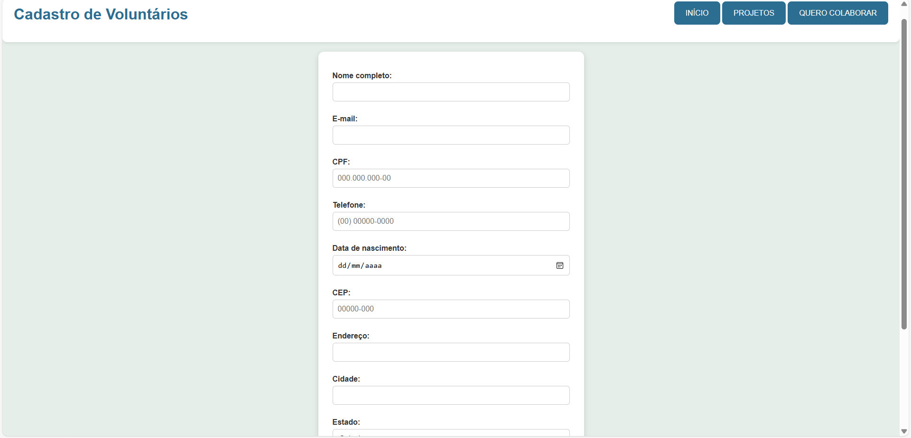
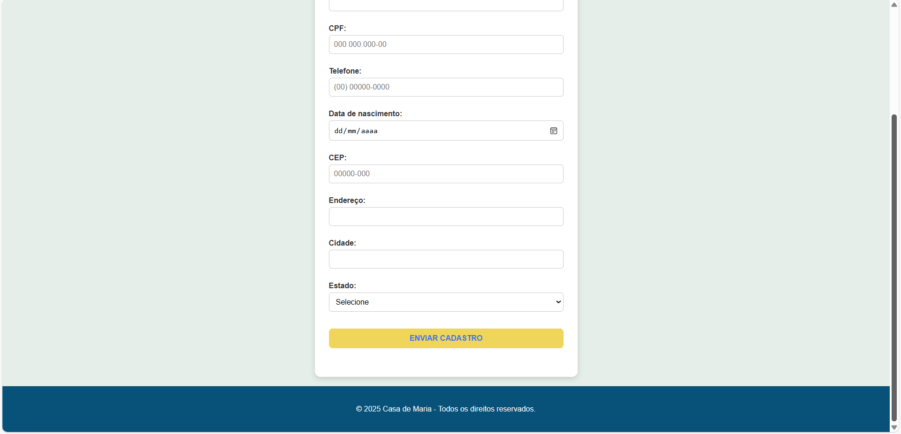

# 🏠 ONG - Casa de Maria - Atividade II

## 🌟 Descrição do Projeto

O projeto **Casa de Maria** é uma ONG que apoia famílias em situação de vulnerabilidade com projetos sociais, doações e voluntariado.  
Nesta segunda entrega, o foco foi aplicar **CSS3**, criando um layout **responsivo**, moderno e acessível, mantendo consistência visual e usabilidade.

---

## 📂 Estrutura do Projeto

ONG-CasaDeMaria/
│
├─ index.html
├─ projetos.html
├─ cadastro.html
├─ css/
│ ├─ variables.css
│ ├─ layout.css
│ ├─ components.css
│ └─ style.css
├─ imagens/
│ ├─ logo.jpg
│ ├─ idoso.jpg
│ └─ ...
└─ README.md

## 🖥️ Demonstração das Páginas

### Página Inicial
  
  
A página de boas-vindas apresenta a ONG, sua missão, visão, valores e informações de contato.

### Projetos
  
  
Sistema de **cards responsivos** exibindo os projetos sociais da ONG.

### Cadastro de Voluntários
  
  
Formulário estilizado, validado e centralizado, para cadastro de voluntários.

---

## 🔧 Funcionalidades

- Menu de navegação principal responsivo, igual em todas as páginas.
- Cards responsivos para exibir projetos.
- Formulário de cadastro com validação visual.
- Botões com estados visuais: hover, active.
- Layout moderno com **Flexbox** e **CSS Grid**.
- Sistema de cores e tipografia consistente usando **CSS Variables**.

---

## 🚀 Como Usar

1. Clone o repositório:
git clone https://github.com/SeuUsuario/ONG-CasadeMariaII.git

## 👩‍💻 Autora
Nathaly Bonfim - Desenvolvedora e criadora do projeto.
